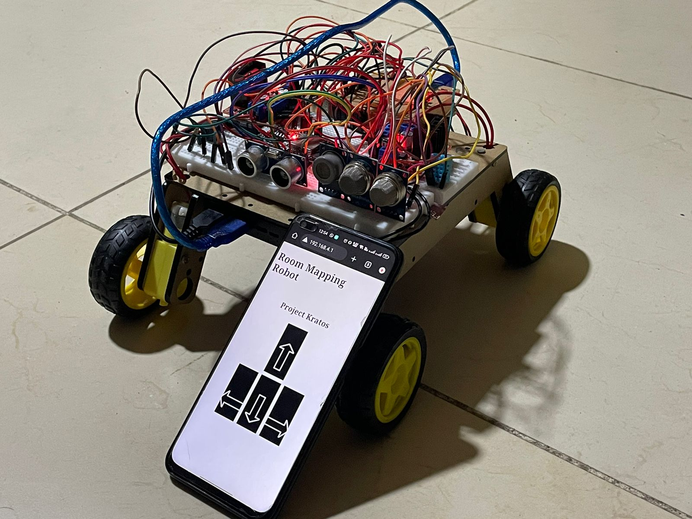
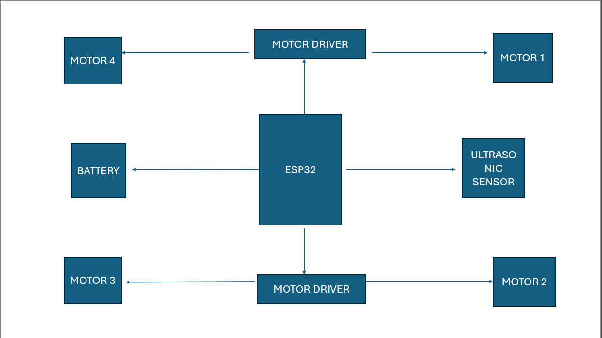
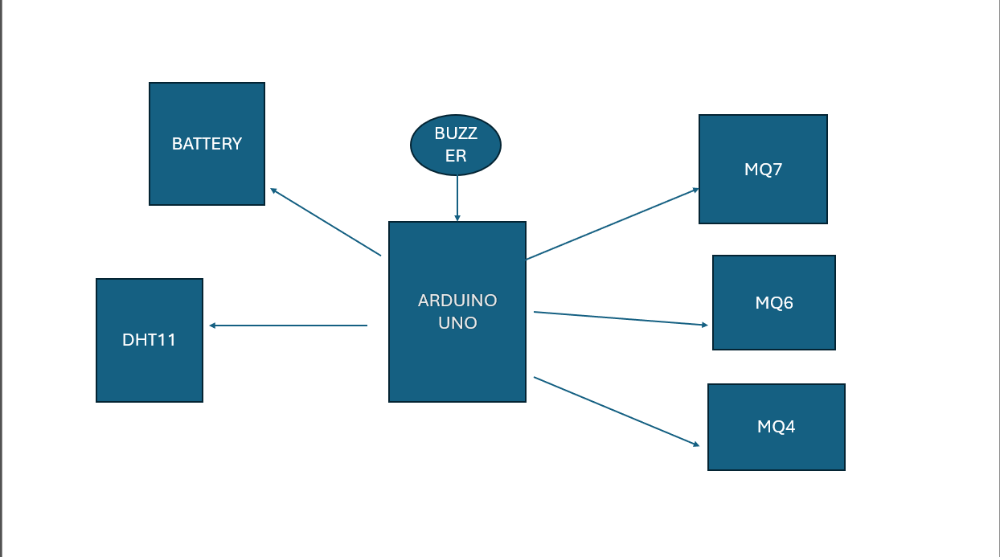

RESCUE ROVER: A Multi-Sensor Controlled
System for Hazardous Environment Exploration

INTRODUCTION

Imagine you're dealing with a situation like a chemical spill in a factory or a collapsed building after an earthquake. These places can be super risky for people to enter because of toxic gases or unstable structures. That's where Rescue Rover comes in. It's like a high-tech robot hero that's built to handle these dangerous situations.
Rescue Rover is packed with sensors and gadgets that allow it to navigate through tricky environments all by itself. It can roll over rough terrain, squeeze through tight spaces, and even climb over obstacles. And while it's doing all that, it's constantly collecting data.
One of the most important things Rescue Rover does is measure the levels of harmful gases in the air. This info is crucial for emergency responders to know before they go in themselves. If there's too much dangerous gas, it's not safe for humans to enter. But with Rescue Rover on the job, we can get that vital data without risking anyone's life.
So, in simple terms, Rescue Rover is like a super-smart robot explorer that goes where it's too dangerous for people to go. It keeps us safe by gathering important information and helping us make better decisions in hazardous situations.

System Architecture:

Rescue Rover comprises several key components, including gas sensors (MQ6,
MQ4, MQ7), an ultrasonic sensor for obstacle detection, an ESP32
microcontroller for wireless communication, an Arduino Uno for sensor
interfacing, four brushless DC motors, two L298N motor drivers, and a DHT11 sensor for temperature and humidity measurement. These components are
integrated into a robust chassis, ensuring stability and maneuverability in diverse terrain conditions.

